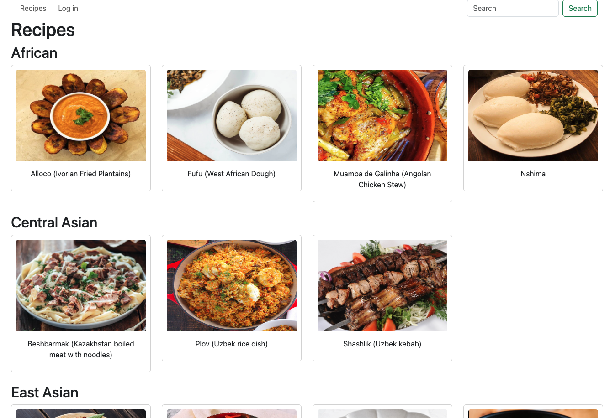
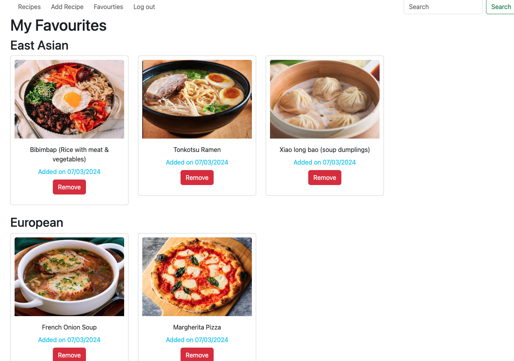

# Recipe App by Hayley

As a food lover, I built this app to add all the recipes I love and would like to try in the future.

The main point of this app is to view the recipes by country of origin (which could be controversial but please forgive me, I've tried my best!), so that I could easily navigate the recipes depending on what I feel like to eat.

This app has a log in feature which allows you to save your favourite recipes in one page + adding recipes.

It also allows you to search recipes by title, so feel free to search your favourite recipes :D

## Images

    
    

## Languages/ Technologies used

* CSS - Bootstrap
* JavaScript - Node.js
* Express
* JavaScript library/ template engine - EJS
* MongoDB & Mongoose
* OAuth (Google)

## UX / UI

As this is a backend heavy project, I have used bootstrap to make things simpler and clearer in order to focus on the functionality.

I still tried to make it look nice and clean, using bright colours!

## Next Steps

* Could add features where it breaks down to acutal country of origin instead of using continents for recipes
* Improvments on search feature - allow users to search by ingredients etc. 
* Improvments on CSS - to make it look more appealing!
